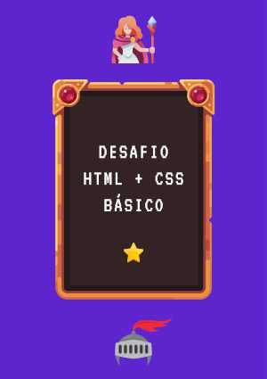
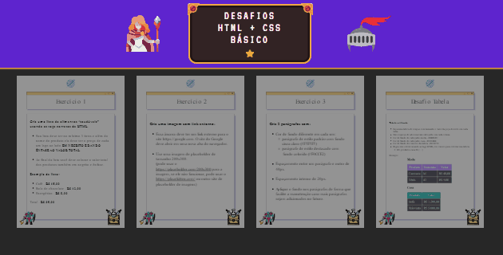
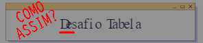
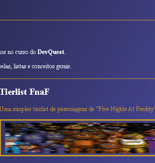

# 🧙‍♂️ Exercícios do curso DevQuest 🧙‍♂️
Uma pequena landing page com links para as páginas dos exercícios propostos no curso.

## Exercícios de HTML + CSS Básico do curso DevQuest
Aqui estão presentes os 4 exercícios apresentados no começo do curso para HTML e CSS.

## 🛠 Tecnologias e Sites Utilizados 🛠
- VS Code // (*escrever o código*)
- Convertio.com // (*conversão de pdf para imagens svg*)
- RealWorld Paint // (*modificar imagens*)
- Paint.Net // (*selecionar cores para rgb*)
- ScreenToGif // (*fazer gifs pro README*)

## 🧩 A Página 🧩
Ela possui um pequeno **cabeçalho** que se assemelha ao design da capa do pdf que apresentava os exercícios.

Fica muito mais visível com telas menores, onde o conteúdo se torna em coluna;

---

Logo abaixo temos os links para os exercícios em si.

Utilizei o site **convertio** para converter as páginas pdf, dos exercícios, em imagens svg, para um uso mais responsivo.

Taquei uns hover para o usuário interagir com as imagens e tornar a experiência mais dinâmica;

As imagens vetorizadas vieram com alguns problemas na exibição, mas o uso de svg não é algo que tenho familiaridade, então não tive como resolver;

Tentar usar jpeg foi ainda pior, e o png continuava ruim ao dar zoom, então mantive as imagens em vetores;

## 🤓 Os Exercícios 🤓
Todos eles foram bem básicos e simples. Talvez o destaque aqui fique para o das tabelas, que foi o mais complicado de enteder o que estava acontecendo, pelo menos na época que realizei o exercício;

### Exercício 1 - Lista e 'negrito'
Bem simples, sem complicação;

*Mas tenho que dizer que a vontade de deixar tudo centralizado é forte;*

---
### Exercício 2 - Imagem com link externo
Mais para aprender o conceito;

A primeira versão tinha a imagem de um site placeholder que acabou morrendo, então tive que trocar para o *placehold.co*... Aí eu errei o link, então tive que mandar outro commit só pra tirar o "*.com*" 🙃;

Mas tudo certo no final;

---
### Exercício 3 - Parágrafos e CSS
Esse foi para entender a criar uma página longeva, que pudesse receber mais conteúdo, usando a base do que já tinha;

Ao revisar o projeto, vi que eu não tinha colocado o *padding* nos parágrafos, que vergonha 😓.

---
### Exercício 4 - Tabela
Muito fácil de escrever o código...

Agora, entender o que eu tinha CTRL+c e CTRL+v foi outra história;

Hoje já entendo as tags, o **como** e **porque** usá-las, mas na época, cheguei a criar uma página, usando tabela, que foi simplesmente abaixo das expectativas pra dizer o mínimo, mas prática é o que leva à perfeição:

*Sim, eu nem sabia usar o ScreenToGif direito...*

## 👨🏽‍💻 Mais Exercícios 👨🏽‍💻
Aqui vai ficar a lista dos outros exercícios:
- [CSS Avançado](https://github.com/Williaw-Al/exercicio-css-grid)